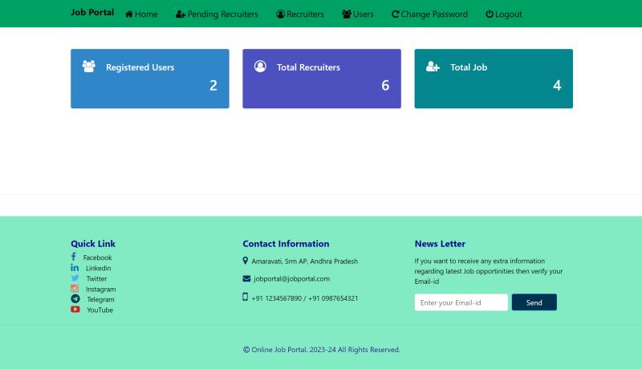
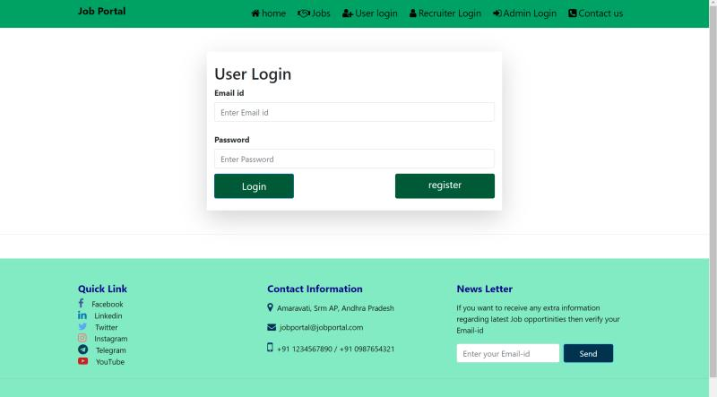
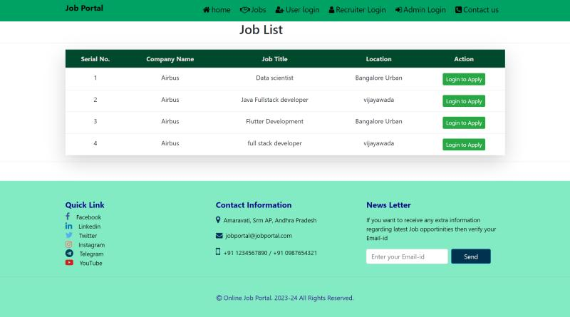
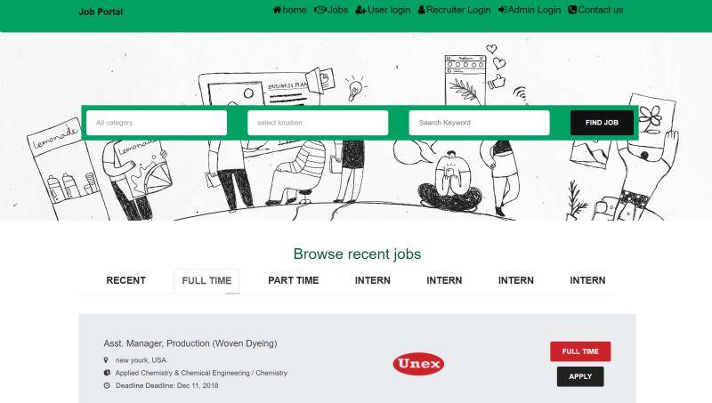

# Job-Portal-Using-Django

## Overview
The **Job Portal System** is a web application developed using the Django framework, designed to streamline the job search and recruitment process. This platform connects **Job Seekers** and **Job Providers** with distinct functionalities for each role. Administrators manage and oversee the platform to ensure its integrity and efficiency.

## Features
### For Job Seekers:
- Browse and search for job listings by title, location, and category.
- View detailed job descriptions and requirements.
- Apply for jobs and track application statuses.

### For Job Providers:
- Create, edit, and manage job listings.
- View and evaluate applications submitted by job seekers.

### For Administrators:
- Manage users and job listings.
- Verify job providers and maintain platform security.
- Monitor applications and platform performance.

## Screenshots
Below are some screenshots showcasing key pages of the application:

---

### 1. **Admin Dashboard**
   

---

### 2. **Recruit Dashboard**
   

---

### 3. **Job Seeker Dashboard**
   

---

### 4. **Login Page**
   

---

### 5. **Latest Jobs**
   

---

### 6. **Homepage**
   

---

## System Requirements
### Server Requirements:
- Processor: Intel Core i5 or equivalent
- RAM: 8GB or higher
- Storage: 100GB SSD or higher

### Client Requirements:
- Processor: Intel Core i3 or equivalent
- RAM: 4GB or higher
- Storage: 128GB HDD or higher
- High-speed internet connection

## Technologies Used
- **Frontend**: HTML, CSS, JavaScript
- **Backend**: Django Framework
- **Database**: SQL-based DBMS
- **Hosting**: Web server supporting Django applications
